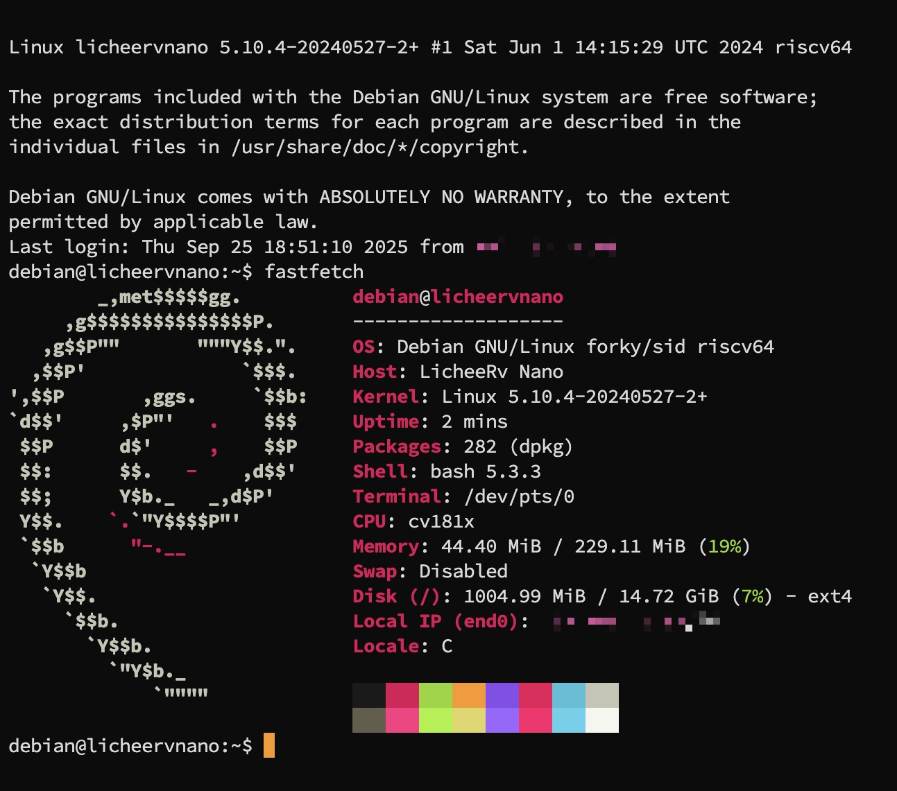

# LicheeRV-Nano-Debian
This repository contains information about running Debian on Sipeed LicheeRV Nano

If this repository has helped you, please give it a star ⭐

# Download image
Go to GitHub and download the latest release: licheervnano_sd.img.lz4

```
https://github.com/Fishwaldo/sophgo-sg200x-debian
```

# Unpack image file
We downloaded the file in .lz4 format, it needs to be converted to .img so that it can be burned to an SD card

In the terminal, using the command, unpack this file in .img
```
lz4 licheelicheervnano_sd.img.lz4
```
Now we have the licheelicheervnano_sd.img file

# Flashing image

Using balenaEtcher or any other method, we write this file to the SD card

# Connect to board

The board receives the IP address via DHCP. 
SSH connection data:
```
debian
```

```
rv
```

# Result

